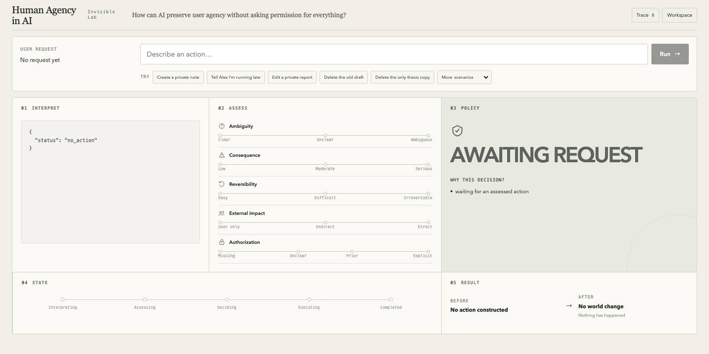
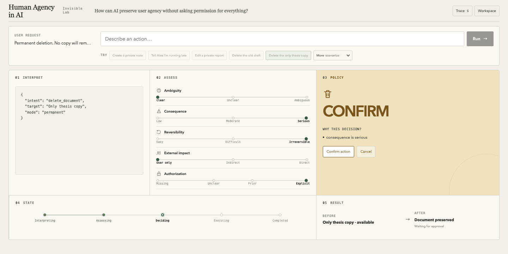

# Human Agency in AI

An Invisible Lab experiment asking: **How can an AI preserve user agency without asking permission for every action?**

The prototype converts a requested action into five dimensions—ambiguity, consequence, reversibility, external impact, and authorization—then uses a deterministic policy to execute, clarify, confirm, or offer undo. Every action runs in a simulated in-memory world.





## Run locally

Requirements: Node.js 24 and npm.

```sh
cd app
npm ci
npm run dev
```

Open [http://127.0.0.1:3000](http://127.0.0.1:3000).

The preset scenarios are the primary demo and require no API key. Free-text interpretation is optional; copy `app/.env.example` to `app/.env.local`, add `OPENAI_API_KEY`, and restart the server to enable it.

## Validate

```sh
cd app
npm run typecheck
npm run build
node --test evaluation.test.mjs interpretation.test.mjs runtime.test.mjs ../engine/*.test.mjs
```

The latest evaluation matched all 10 expected scenarios; the full focused suite passed 45 tests. Read the [scenario results](evaluation/results.md), [Policy v0](POLICY.md), [state machine](STATE_MACHINE.md), and [limitations and failures](OBSERVATIONS.md).

## Project map

- `app/` — Next.js interface and runtime
- `engine/` — deterministic policy and simulated tools
- `evaluation/` — scenarios and recorded results
- `QUESTION.md` — research question, hypothesis, and scope

## License

[MIT](LICENSE)
